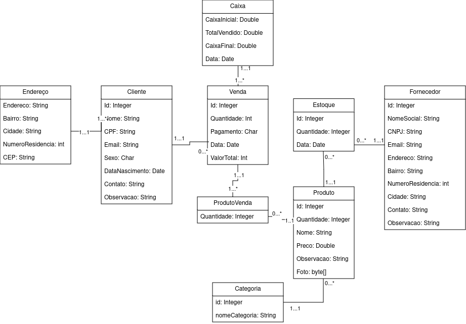

# Sistema de Desktop para Mercearia

Bem-vindo ao repositório do Sistema de Desktop para Mercearia. Este software foi desenvolvido para ajudar na gestão eficiente de mercearias, permitindo o controle de estoque, vendas e fornecedores.

## Funcionalidades

- **Controle de Estoque**: Adicione, remova e gerencie produtos no estoque.
- **Gestão de Vendas**: Realize vendas, registre transações e gere relatórios.
- **Cadastro de Fornecedores**: Mantenha informações atualizadas sobre seus fornecedores.
- **Relatórios e Análises**: Gere relatórios simples sobre vendas e estoque.

## Requisitos

- **Sistema Operacional**: Windows, macOS ou Linux.
- **Dependências**: [Hibernate, Postgresql, JDK 17, Java Swing]

## Instalação

Para instalar o sistema, siga estas etapas:

1. Clone o repositório:
   ```bash
   git clone https://github.com/seuusuario/seurepositorio.git

## Diagrama de Classe

